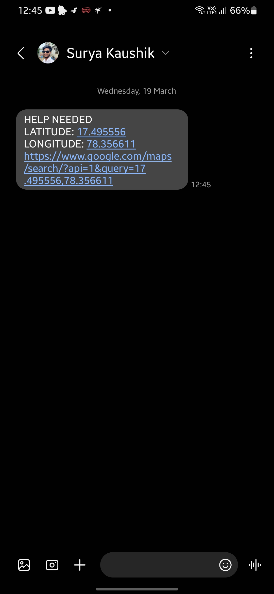

# KAVACH | Emergency Safety App

# Features

- Developed an **Android application** to enhance personal safety, providing a quick and effective way to send emergency alerts.
- Implemented an **Emergency Contact Setup** feature, allowing users to add and manage a list of trusted emergency contacts.
- Integrated an **Emergency Trigger** functionality that can be activated via a prominent button and voice detection.
- Automated **Location-Based SMS**, retrieving the user’s location using **GPS** or network services and sending it to emergency contacts.
- Focused on creating a **simple and user-friendly interface**, prioritizing ease of use in high-stress situations.

# Screenshots

    

        
        
Home Screen

    

    

        
        
Contacts Screen

    

    

        
        
Add Contact

    

    

        
        
Import Contacts

    

    

        
        
View Contacts

    

    

        
        
Press to Say Kavach

    

    

        
        
Kavach Detected

    

    

        
        
SMS

    

# Tech stack:
- Kotlin
- Jetpack Compose
- SMS & GPS services

# Requirements

- Android Studio Ladybug | 2024.2.1
- Android 10 (API level 29) or above
- Gradle Version - 8.9
- Android Gradle Plugin Version - 8.7.0
- Java Development Kit (JDK) Version - JDK 19
- Kotlin Version - 2.0.0
- For more [click here](https://github.com/kaushik8946/Kavach/blob/main/gradle/libs.versions.toml)
